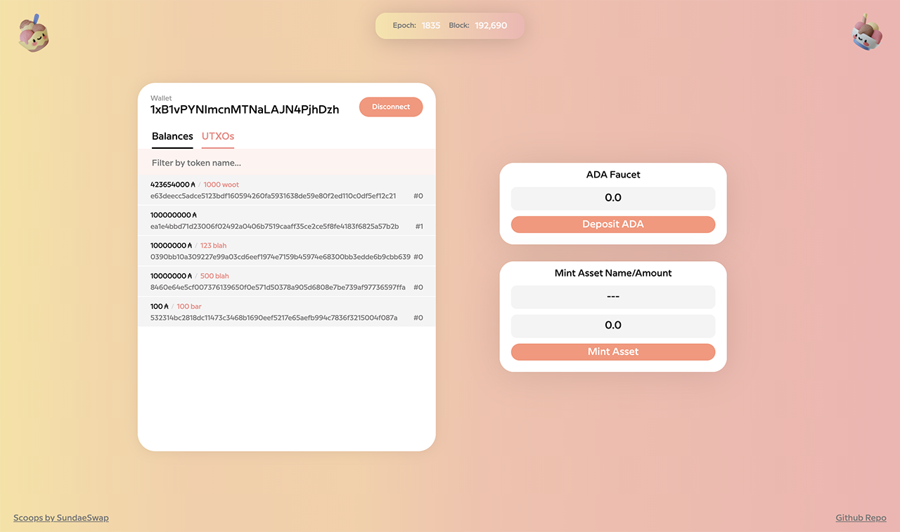

cardano-toolkit
------------------



`cardano-toolkit` simplifies the development of Cardano smart contracts 
by providing teams with frequently needed tasks:

* Mint Tokens
* Create Wallet
* Fund Wallet
* Transfer Funds
* Calculate Fees

### Quick Start

## Running docker (interactive mode)

Launch the `cardano-toolkit` server which exposes a graphql endpoint, `/graphql`

```
export TREASURY_ADDR="..."              # address of treasury wallet e.g. addr
export TREASURY_SIGNING_KEY_FILE="..."  # path to .skey file
docker run -it --rm \
  -p 3200:3200 \
  -v /nix:/nix \
  -v ${HOME}:${HOME} \
  sundaeswap/cardano-toolkit \
    --dir ${HOME}/sundaeswap/data \
    --cardano-cli ${HOME}/bin/cardano-cli \
    --socket-path "${CARDANO_NODE_SOCKET_PATH}" \
    --testnet-magic 31415 \
    --treasury-addr "${TREASURY_ADDR}" \
    --treasury-skey-file "${TREASURY_SIGNING_KEY_FILE}"
```

The graphql endpoint will be on port 3200 at `/graphql`

Notes:
* `/nix` is mounted assuming the `cardano-cli` was built with nix and needs access to `/nix/store`
* `${HOME}` is mounted because `cardano-toolkit` needs to be able to read files written by the `cardano-cli`
* make sure `--dir` points to a mounted directory or each restart will lose your data  
* to run this as a daemon, switch `docker run -it --rm` to `docker run -d`

## Building 

#### docker image

```docker build -t sundaeswap/cardano-toolkit .```


#### self contained cli

Assuming go 1.16 or better and node 1.14 or better are installed 

```
(cd ui && yarn install && yarn local:build)
GOOS=linux go build
```

Change GOOS to match your target OS e.g. darwin, linux, windows, etc

## Concepts

#### Dir

`cardano-toolkit` stores its data in the directory passed in via `--dir` 

#### Minting

Minted tokens are in the namespace of the wallet that generated them.  That
wallet can mint as many or few tokens as it wishes.  However, tokens minted by
one wallet are not fungible with tokens minted by another wallet.

#### Wallets

`cardano-toolkit` generates only the loosest concept of a wallet.  It makes no
attempt at securing the wallet as it is designed for development purposes only.

`cardano-toolkit` considers a Wallet™ to be a randomly generated string that the
server can associate with various public/private keys.  Specifically, they can
be found at

```${DIR}/wallets/${wallet}.(addr|skey|vkey|stake.skey|...)```

Because the wallet is just a string, it simplifies the interaction with the
frontend as it can put in a cookie, local storage, whatever is convenient.

#### Treasury

The treasury wallet is any wallet with sufficient ADA to fund other wallets.  
Most often, this will be the wallet funded via the faucet.  `cardano-toolkit`
will need access to the wallet address as well as the signing key (.skey)
